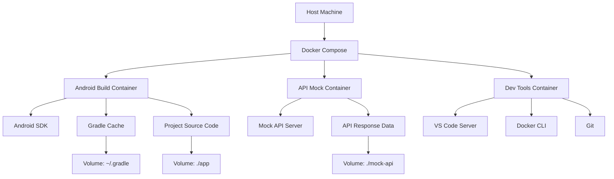

# Docker Development Environment Plan for IuranKomplek

## Overview
This document outlines the complete Docker-based sandbox environment for the IuranKomplek Android application. The solution provides an isolated, consistent, portable, and reproducible development environment.

## Architecture Design

### Container Architecture


## Implementation Files

### 1. Dockerfile for Android Build Environment

**File: Dockerfile.android**
```dockerfile
# Android Build Environment Dockerfile for IuranKomplek
# Based on official Android Docker images

# Use the latest Android SDK image
FROM androidsdk/android-sdk:34

# Set working directory
WORKDIR /workspace

# Install additional required packages
RUN apt-get update && apt-get install -y \
    git \
    wget \
    curl \
    unzip \
    zip \
    openjdk-8-jdk \
    && rm -rf /var/lib/apt/lists/*

# Download and install Android SDK build tools
RUN echo "y" | sdkmanager --install "build-tools;34.0.0" "platform-tools" "platforms;android-34"

# Set environment variables
ENV ANDROID_SDK_ROOT=/opt/android-sdk
ENV PATH=$PATH:$ANDROID_SDK_ROOT/platform-tools
ENV JAVA_HOME=/usr/lib/jvm/java-8-openjdk-amd64

# Copy Gradle wrapper
COPY gradle/ /workspace/gradle/
COPY gradlew /workspace/
COPY gradlew.bat /workspace/

# Copy project files
COPY . /workspace/app/

# Set permissions for Gradle wrapper
RUN chmod +x /workspace/gradlew

# Create gradle.properties for Docker environment
RUN echo 'org.gradle.jvmargs=-Xmx2048m -Dfile.encoding=UTF-8' > /workspace/gradle.properties

# Expose build output directory
VOLUME ["/workspace/app/build"]

# Default command
CMD ["/bin/bash"]
```

### 2. Docker Compose Configuration

**File: docker-compose.yml**
```yaml
version: '3.8'

services:
  # Android Build Container
  android-builder:
    build:
      context: .
      dockerfile: Dockerfile.android
    container_name: iuran-android-builder
    volumes:
      - ./:/workspace/app
      - gradle-cache:/home/gradle/.gradle
      - android-sdk-cache:/opt/android-sdk
      - ~/.ssh:/root/.ssh  # For Git operations
    working_dir: /workspace/app
    environment:
      - GRADLE_USER_HOME=/home/gradle/.gradle
    networks:
      - iuran-network
    tty: true

  # API Mock Container
  api-mock:
    build:
      context: ./mock-api
      dockerfile: Dockerfile.mock-api
    container_name: iuran-api-mock
    ports:
      - "8080:5000"
    volumes:
      - ./mock-api:/app
    networks:
      - iuran-network
    restart: unless-stopped

  # Development Tools Container
  dev-tools:
    image: vscode-devcontainers/android:latest
    container_name: iuran-dev-tools
    volumes:
      - ./:/workspace
      - ~/.ssh:/home/vscode/.ssh
      - /var/run/docker.sock:/var/run/docker.sock
    ports:
      - "8081:8080"
    working_dir: /workspace/app
    networks:
      - iuran-network
    environment:
      - DOCKER_HOST=unix:///var/run/docker.sock
    depends_on:
      - android-builder
      - api-mock

volumes:
  gradle-cache:
  android-sdk-cache:

networks:
  iuran-network:
    driver: bridge
    ipam:
      config:
        - subnet: 172.20.0.0/16
```

### 3. Mock API Server Configuration

**File: mock-api/Dockerfile.mock-api**
```dockerfile
# Mock API Server for IuranKomplek
FROM python:3.9-slim

WORKDIR /app

# Install dependencies
RUN pip install flask flask-cors

# Copy mock API files
COPY app.py .
COPY mock-data/ ./mock-data/

# Expose port
EXPOSE 5000

# Start the mock server
CMD ["python", "app.py"]
```

**File: mock-api/app.py**
```python
from flask import Flask, jsonify, request
from flask_cors import CORS
import json
import os

app = Flask(__name__)
CORS(app)

# Load mock data
def load_mock_data(filename):
    with open(f'mock-data/{filename}', 'r') as f:
        return json.load(f)

@app.route('/data/QjX6hB1ST2IDKaxB/', methods=['GET'])
def get_users():
    try:
        users = load_mock_data('users.json')
        return jsonify(users)
    except Exception as e:
        return jsonify({"error": str(e)}), 500

@app.route('/data/<spreadsheet_id>/', methods=['GET'])
def get_pemanfaatan(spreadsheet_id):
    try:
        if spreadsheet_id == "QjX6hB1ST2IDKaxB":
            data = load_mock_data('pemanfaatan.json')
            return jsonify(data)
        return jsonify({"error": "Spreadsheet not found"}), 404
    except Exception as e:
        return jsonify({"error": str(e)}), 500

if __name__ == '__main__':
    app.run(host='0.0.0.0', port=5000, debug=True)
```

### 4. Development Scripts

**File: scripts/setup-dev-env.sh**
```bash
#!/bin/bash
# Setup Docker development environment for IuranKomplek

echo "Setting up Docker development environment for IuranKomplek..."

# Create necessary directories
mkdir -p mock-api/mock-data
mkdir -p scripts

# Build and start containers
echo "Building and starting Docker containers..."
docker-compose up --build -d

# Wait for services to be ready
echo "Waiting for services to be ready..."
sleep 10

# Initialize Android SDK
echo "Initializing Android SDK..."
docker-compose exec android-builder /workspace/gradlew --version

# Download Android SDK components
echo "Downloading Android SDK components..."
docker-compose exec android-builder sdkmanager --install "platforms;android-34" "build-tools;34.0.0"

echo "Setup complete! You can now:"
echo "1. Access VS Code at http://localhost:8081"
echo "2. Access mock API at http://localhost:8080"
echo "3. Run builds with: docker-compose exec android-builder ./gradlew build"
```

**File: scripts/build.sh**
```bash
#!/bin/bash
# Build script for IuranKomplek using Docker

echo "Building IuranKomplek with Docker..."

# Build the Android app
docker-compose exec android-builder ./gradlew assembleDebug

# Copy the APK to local directory
echo "Copying APK to local directory..."
docker-compose cp android-builder:/workspace/app/app/build/outputs/apk/debug/app-debug.apk .

echo "Build complete! APK available at: app-debug.apk"
```

**File: scripts/test.sh**
```bash
#!/bin/bash
# Test script for IuranKomplek using Docker

echo "Running tests for IuranKomplek..."

# Run unit tests
echo "Running unit tests..."
docker-compose exec android-builder ./gradlew test

# Run instrumented tests (if emulator is available)
echo "Running instrumented tests..."
docker-compose exec android-builder ./gradlew connectedAndroidTest

echo "Tests completed!"
```

### 5. Docker Ignore File

**File: .dockerignore**
```
# Git files
.git
.gitignore

# IDE files
.idea/
.vscode/
*.iml
*.ipr
*.iws

# OS files
.DS_Store
Thumbs.db

# Build artifacts
app/build/
app/app/build/
*.apk
*.aab

# Gradle files
.gradle/
build/

# Local properties
local.properties

# Logs
*.log
logs/

# Temporary files
tmp/
temp/

# Docker files (to avoid recursion)
Dockerfile*
docker-compose*
.dockerignore
```

## Development Workflow

### 1. Environment Setup
1. Run `./scripts/setup-dev-env.sh` to initialize the Docker environment
2. Access VS Code at http://localhost:8081
3. Configure the IDE to use the Docker-based Android SDK

### 2. Development Process
1. Code changes are automatically synced to containers
2. Build the app using `./scripts/build.sh` or Docker commands directly
3. Run tests with `./scripts/test.sh`
4. Access the mock API at http://localhost:8080

### 3. Deployment
1. Build release APK: `docker-compose exec android-builder ./gradlew assembleRelease`
2. Copy APK: `docker-compose cp android-builder:/workspace/app/app/build/outputs/apk/release/app-release.apk .`

## Configuration Files

### 1. Update ApiConfig.kt for Docker Environment
```kotlin
// Update the API base URL to use the mock server in Docker environment
private const val BASE_URL = if (BuildConfig.DEBUG) {
    "http://api-mock:5000/data/QjX6hB1ST2IDKaxB/\n\n"
} else {
    "https://api.apispreadsheets.com/data/QjX6hB1ST2IDKaxB/\n\n"
}
```

### 2. Mock API Data Files

**File: mock-api/mock-data/users.json**
```json
{
  "data": [
    {
      "id": "1",
      "nama": "John Doe",
      "alamat": "Jl. Contoh No. 1",
      "no_hp": "081234567890",
      "email": "john@example.com"
    },
    {
      "id": "2",
      "nama": "Jane Smith",
      "alamat": "Jl. Contoh No. 2",
      "no_hp": "081234567891",
      "email": "jane@example.com"
    }
  ]
}
```

**File: mock-api/mock-data/pemanfaatan.json**
```json
{
  "data": [
    {
      "id": "1",
      "nama": "John Doe",
      "bulan": "Januari",
      "tahun": "2024",
      "total_iuran_individu": "150000",
      "status": "Lunas"
    },
    {
      "id": "2",
      "nama": "Jane Smith",
      "bulan": "Januari",
      "tahun": "2024",
      "total_iuran_individu": "150000",
      "status": "Belum Lunas"
    }
  ]
}
```

## Benefits of This Docker Setup

1. **Consistency**: All developers use identical environments
2. **Isolation**: Development environment is completely contained
3. **Portability**: Environment can be recreated anywhere Docker runs
4. **Speed**: Cached dependencies and optimized build processes
5. **Reproducibility**: Identical builds across all stages
6. **Offline Capability**: Mock API allows development without network
7. **Simplified Setup**: One command to set up the entire environment
8. **Resource Efficiency**: Containers share resources efficiently

## Next Steps

1. Verify Docker installation on the host system
2. Create the Docker files and scripts as outlined above
3. Test the environment setup and build process
4. Integrate with existing CI/CD pipeline if applicable
5. Document the setup process for team members